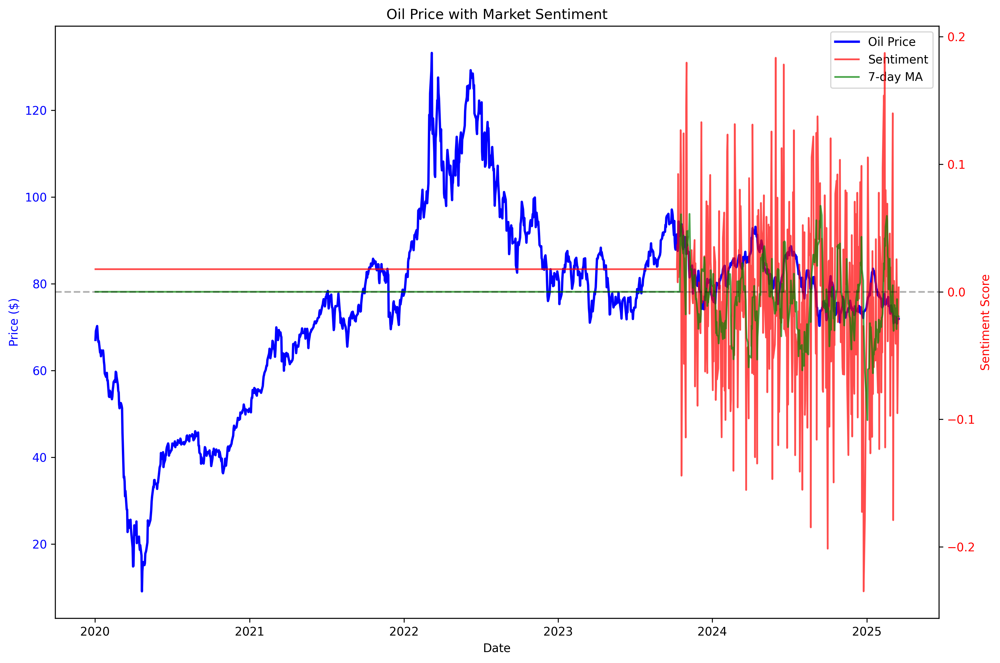

# Oil Prophet


## Advanced Oil Price Forecasting System

Oil Prophet is a sophisticated forecasting system that combines advanced time-series decomposition techniques with deep learning (LSTM with attention mechanism) and alternative data sources to predict oil price movements with higher accuracy than traditional methods.

> 🚀 **Development Progress**: Core components including data processing, signal decomposition, forecasting models, and market sentiment analysis have been implemented and successfully tested. The system now supports visualization and evaluation of model performance.

## Features

### Implemented
- **Data Processing Pipeline**: Robust data loading and preprocessing for multi-timeframe analysis
- **Signal Decomposition**: Time series decomposition into trend, cyclical, and residual components using advanced filtering techniques
- **LSTM with Attention Model**: Deep learning forecasting with attention mechanisms to focus on relevant parts of the input sequence
- **Baseline Models**: Simple forecasting models for performance benchmarking
- **Ensemble Approach**: Combines predictions from multiple models for more robust forecasts
- **Market Sentiment Analysis**: Sentiment analysis of oil-related discussions with simulated data
- **Sentiment-Enhanced Forecasting**: Integration of sentiment features with price data for improved prediction
- **Visualization System**: Comprehensive visualization tools for time series data, decomposition, forecasts, and model comparison
- **Evaluation Framework**: Rigorous model evaluation with multiple metrics and statistical significance testing

### Planned
- **Real-time Sentiment Analysis**: Integration with Reddit API for live sentiment analysis
- **Interactive Dashboard**: Web-based interface for exploring forecasts and model performance
- **API Development**: Exposing model predictions through a REST API

## Project Structure

```
oil-prophet/
├── data/
│   ├── raw/                 # Raw oil price data files
│   └── processed/           # Processed datasets and sentiment data
├── models/                  # Saved model files and evaluation results
├── notebooks/
│   └── plots/               # Generated visualization plots
├── src/
│   ├── data/
│   │   └── preprocessing.py # Data loading and preprocessing
│   ├── models/
│   │   ├── ceemdan.py       # Signal decomposition implementation
│   │   ├── lstm_attention.py # LSTM with attention implementation
│   │   ├── ensemble.py      # Ensemble forecasting models
│   │   └── baseline.py      # Baseline forecasting models
│   ├── evaluation/
│   │   └── metrics.py       # Evaluation metrics and testing
│   ├── visualization/
│   │   └── plots.py         # Visualization functions
│   ├── nlp/
│   │   ├── bert_sentiment.py      # BERT sentiment analysis
│   │   ├── config_setup.py        # Reddit API configuration
│   │   └── sentiment_demo.py      # Sentiment integration demo
│   └── api/                 # (Planned) API implementation
├── tests/
├── requirements.txt
├── setup_checker.py         # System setup verification
├── .gitignore
├── README.md
└── LICENSE
```

## Recent Achievements

✅ **Sentiment Integration Working**: Successfully implemented and tested sentiment analysis integration with oil price data, generating enhanced features for the forecasting models.

✅ **Enhanced Feature Creation**: The system now combines price data with sentiment indicators to create richer input features for the LSTM model, potentially improving forecasting accuracy.

✅ **Visualization of Price-Sentiment Relationship**: Created visualization tools that show the relationship between oil prices and market sentiment over time.

## Roadmap

- [x] Project structure setup
- [x] Data collection (historical oil prices)
- [x] Data preprocessing pipeline
- [x] Signal decomposition implementation
- [x] LSTM with attention implementation
- [x] Baseline models implementation
- [x] Ensemble model development
- [x] Visualization system
- [x] Model evaluation framework
- [x] Sentiment analysis implementation
- [x] Sentiment-enhanced feature creation
- [ ] Interactive visualization dashboard
- [ ] API development

## Getting Started

### Prerequisites
- Python 3.8+
- Dependencies listed in requirements.txt

### Installation

1. Clone the repository:
   ```bash
   git clone https://github.com/yourusername/oil-prophet.git
   cd oil-prophet
   ```

2. Install dependencies:
   ```bash
   pip install -r requirements.txt
   ```

3. Verify setup:
   ```bash
   python setup_checker.py
   ```

4. Set up Reddit API credentials (optional):
   ```bash
   python -m src.nlp.config_setup
   ```
   Update the generated `reddit_config.json` with your credentials.

### Usage Examples

1. Data preprocessing:
   ```bash
   python -m src.data.preprocessing
   ```

2. Run signal decomposition:
   ```bash
   python -m src.models.ceemdan
   ```

3. Generate visualizations:
   ```bash
   python -m src.visualization.plots
   ```

4. Evaluate model performance:
   ```bash
   python -m src.evaluation.metrics
   ```

5. Run sentiment analysis demo:
   ```bash
   python -m src.nlp.sentiment_demo
   ```

## Applications

This forecasting system is valuable for:

- **Investment Decisions**: Helping investors make informed decisions for commodities trading
- **Risk Management**: Assisting companies in hedging strategies based on expected price movements
- **Budget Planning**: Supporting businesses in financial planning that depends on oil price forecasts
- **Market Research**: Providing insights into the relationship between market sentiment and oil prices

## Advanced Features

### Sentiment-Enhanced Forecasting

The system now successfully integrates sentiment data with price information, creating enhanced feature vectors for the LSTM model. This allows the model to capture both technical price patterns and market psychology, potentially improving prediction accuracy during periods of high market emotion.



The visualization above shows how oil prices (blue) correlate with market sentiment (red) and its 7-day moving average (green). Note how sentiment often leads price movements or reacts to sudden price changes.

### Enhanced Feature Creation

The demo generates enhanced feature vectors that combine:
- Historical price data (30-day windows)
- Sentiment compound scores
- Positive and negative sentiment ratios
- 7-day sentiment moving averages

These richer feature vectors provide the model with more context about market conditions during training, potentially leading to more accurate forecasts.

## License

This project is licensed under the MIT License - see the LICENSE file for details.

## Acknowledgments

- This project's approach is inspired by recent research in hybrid forecasting models
- Oil price data sourced from public datasets